# Architecture Diagrams

> Multi-Echelon Stochastic Newsvendor Inventory Optimization Engine
> Bachelor Thesis Project — IIT Kharagpur

All diagrams are also available as high-resolution PNGs in [`diagrams/`](diagrams/) (generated by `python generate_diagrams.py --dpi 300`).

---

## 1. System Architecture — Module Dependency Graph

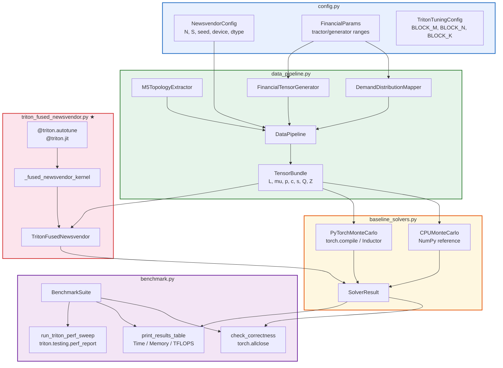

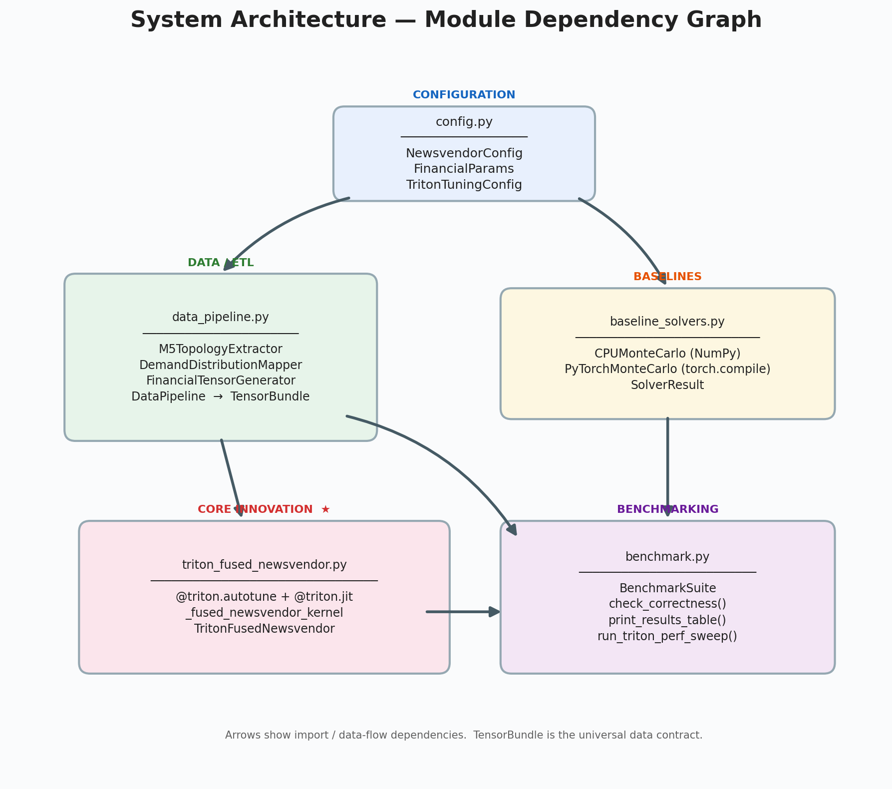

---

## 2. Data Pipeline — ETL Flow

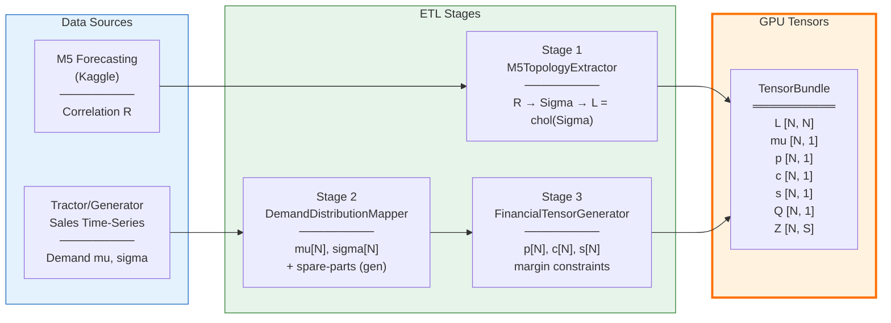

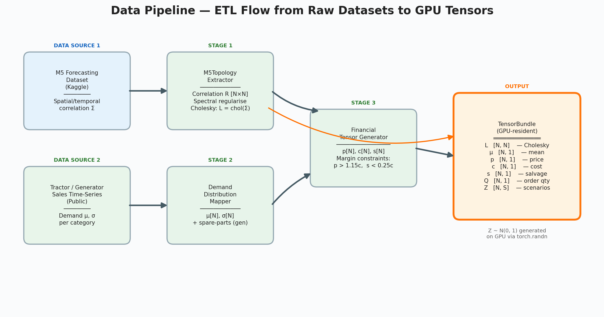

---

## 3. Triton Kernel — 2-D Grid Layout & Tiled Execution

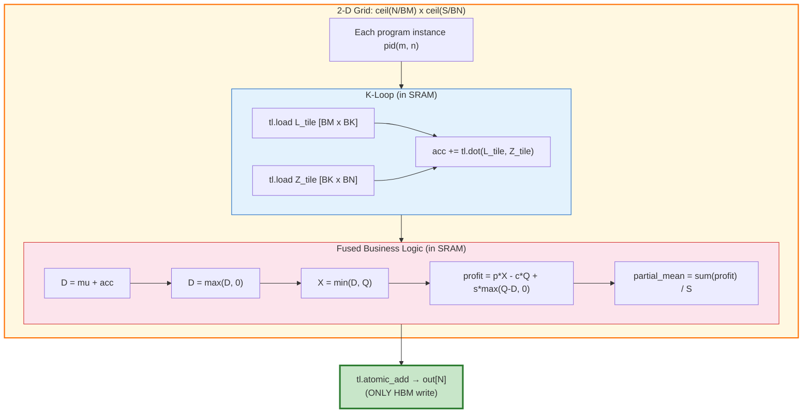

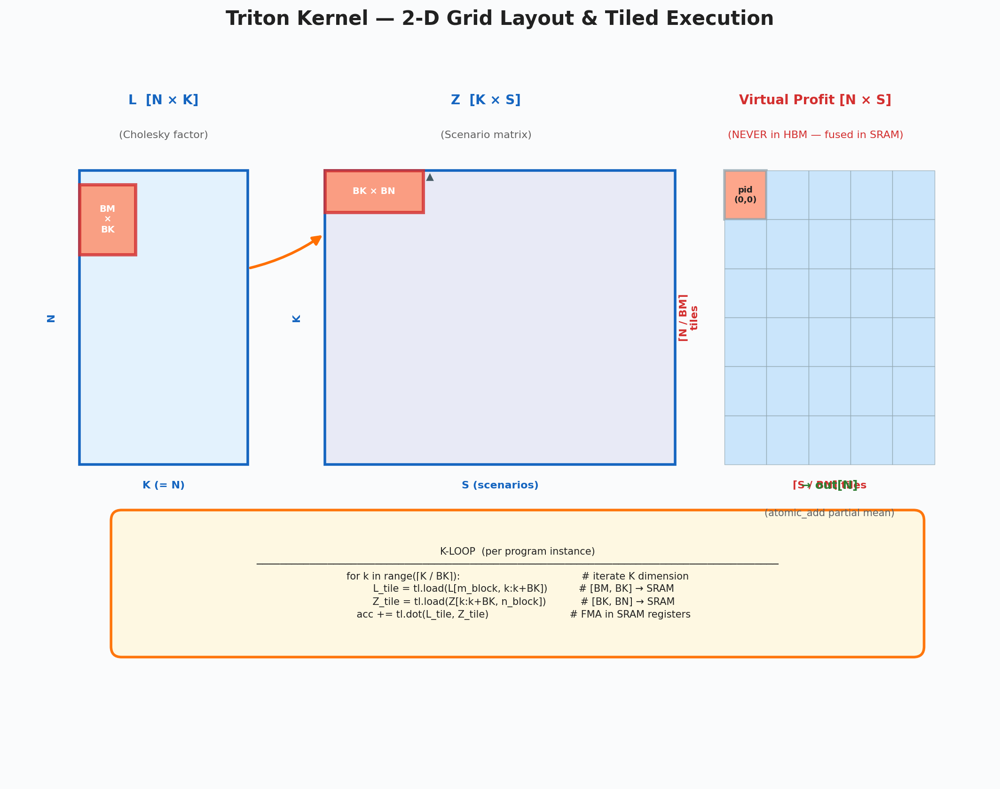

---

## 4. Memory Hierarchy — PyTorch Baseline vs Triton Fused

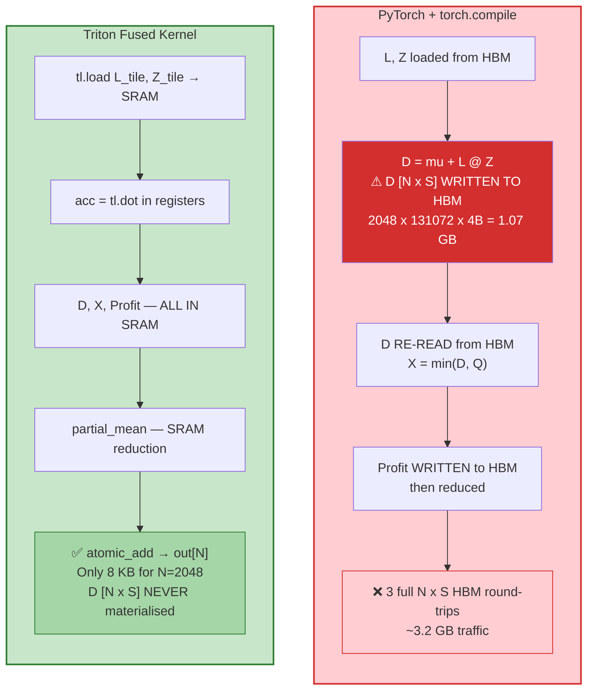

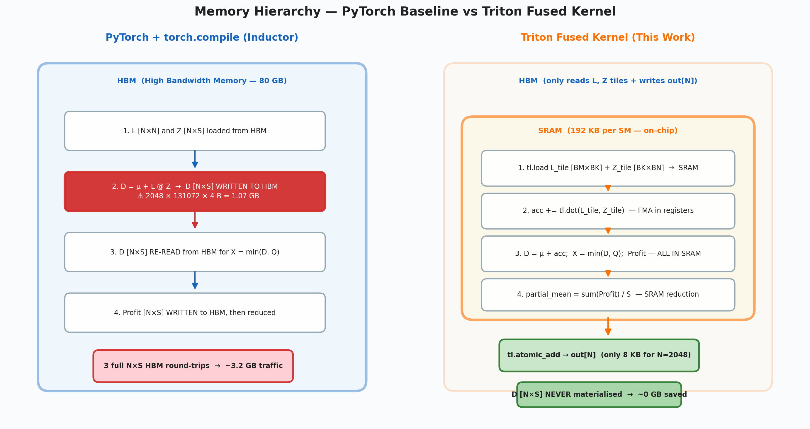

---

## 5. Newsvendor Mathematical Flow

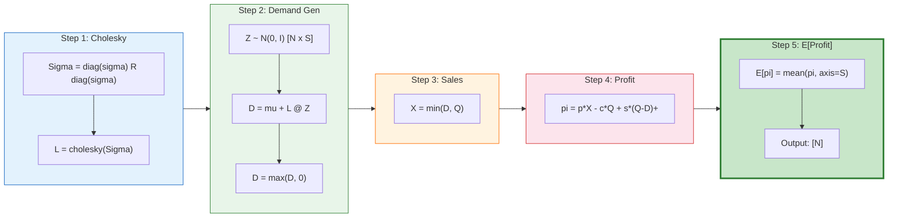

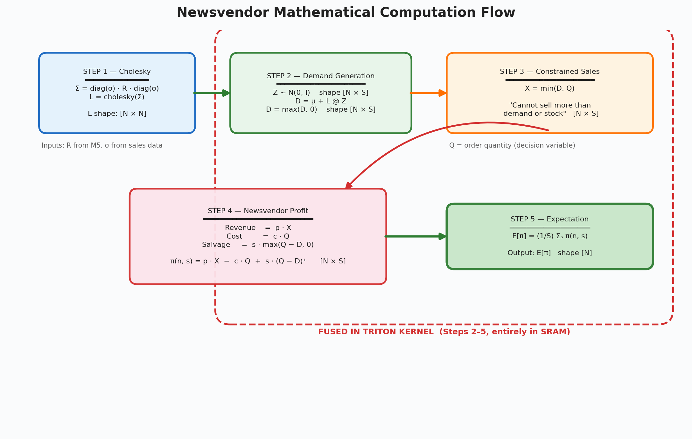

---

## 6. Benchmark & Validation Pipeline

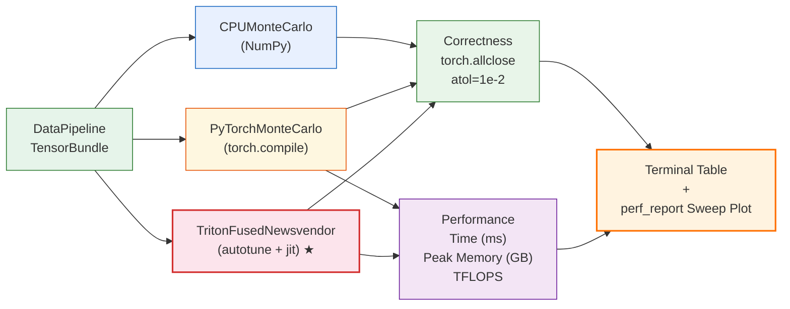

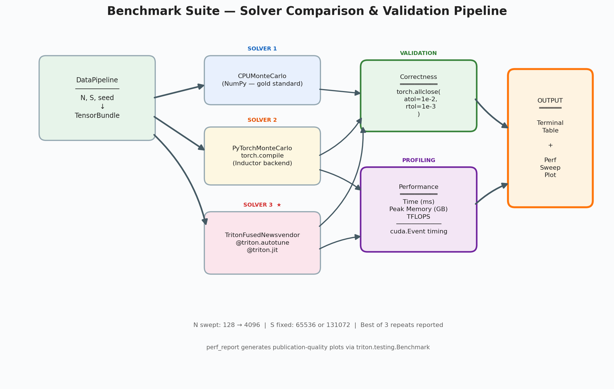

---

## Regenerating Diagrams

```bash
# Screen quality (200 DPI, default)
python generate_diagrams.py

# Thesis print quality (300 DPI)
python generate_diagrams.py --dpi 300
```
